# 📐 Wiki: Arquitectura 'Diamond Tier' — pfQuest [v5.3.2]

Estructura técnica de la **Optimized Edition** mantenida por **DarckRovert**.

## 🏗️ Jerarquía del Motor de Misiones (Engine hierarchy)

El core de pfQuest interactúa directamente con los eventos del cliente de WoW (1.12.1) y gestiona la visualización mediante capas:

1.  **Hueso Central (`quest.lua`)**: Escucha `QUEST_LOG_UPDATE` y `UNIT_QUEST_LOG_CHANGED`. Gestiona la base de datos de misiones activas y completadas.
2.  **Motor de Capas (`map.lua`)**: Dibuja texturas sobre el WorldMapFrame y Minimap. Gestiona los iconos de las misiones.
3.  **Sistema de Navegación (`route.lua`)**: Calcula distancias geográficas y activa la flecha de proximidad.
4.  **Buscador Interno (`db.xml / locales.xml`)**: Carga los datos de NPCs, objetos y misiones (ES-EN).

---

## 🧭 Diagrama de Flujo: Throttling Engine v5.3.2

```mermaid
graph TD
    A[Evento WoW: QUEST_LOG_UPDATE] --> B{Filtro de Frecuencia}
    B -- Menos de 0.2s --> Z[Bypass / Idle]
    B -- Mas de 0.2s --> C[Escaneo de Base de Datos]
    C --> D[Actualizar Estado de Tracker]
    D --> E[Llamar al Navegador]
    E --> F{¿Jugador en Movimiento?}
    F -- No --> G[Sin Recálculo de Ruta]
    F -- Sí --> H[Actualizar Distancias Route.lua]
    H --> I[Render de Iconos: Map.lua]
    I --> J[FPS Boost: Animaciones Throttled 0.05s]
```

## ⚡ Estrategias de Optimización Diamond Tier

- **Throttled OnUpdate**: Reducción de la carga de CPU mediante el espaciado de ciclos de cálculo.
- **Early-Exit Logic**: Si el escaneo detecta que no hay cambios en la cola de misiones, el motor detiene la ejecución inmediatamente (`return`).
- **Asynchronous GUI**: El procesamiento del fader del tracker se desvincula del motor principal para evitar picos de FPS.

---
© 2026 **DarckRovert** — El Séquito del Terror.
*Ingeniería de alto rendimiento para la conquista de Azeroth.*

