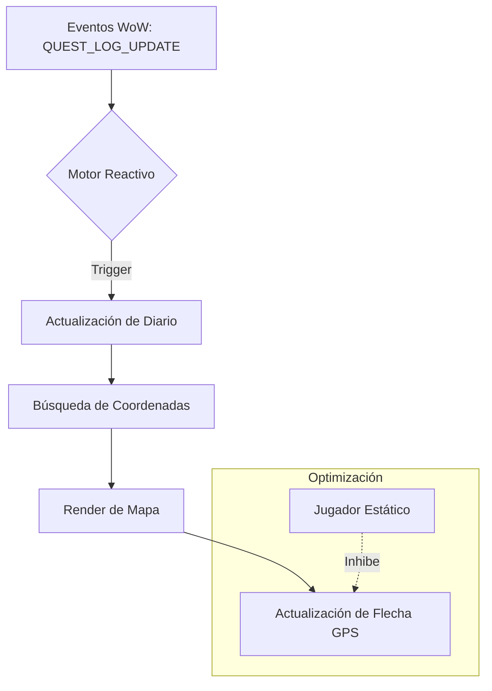

# Arquitectura Técnica - pfQuest [Séquito]

pfQuest utiliza una arquitectura modular diseñada para el alto rendimiento en el cliente 1.12.1.

## Componentes Principales

1. **pfDatabase (Logic)**: Gestiona la carga, búsqueda y filtrado de datos. En la **v5.3.3**, se ha optimizado para ser puramente reactiva.
2. **pfMap (Render)**: El motor gráfico que dibuja nodos en el Mapa Mundial y Minimapa. Utiliza un sistema de capas para priorizar iconos de misiones activas.
3. **pfQuest.route (GPS)**: El motor de cálculo vectorial. Calcula distancias y ángulos para la flecha de navegación.

## Flujo de Datos [Lag-Free 1.17]

## Sistema de Fusión Inteligente
Para resolver la coalición entre datos técnicos de Turtle WoW y localizaciones en español, implementamos en `patchtable.lua` un mecanismo de protección que guarda los nombres en el campo `.name` de la tabla de zonas, preservando los punteros de herencia de mapas (hierarchy).
